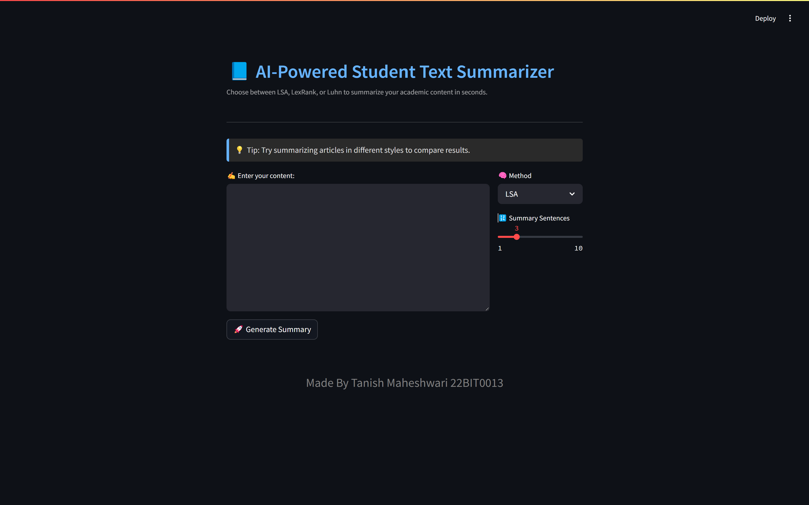

# 📘 AI-Powered Student Text Summarizer

A Streamlit web app that uses Natural Language Processing (NLP) to summarize academic content like lecture notes, articles, or research papers. Choose between **LSA**, **LexRank**, and **Luhn** summarization algorithms to generate concise, readable summaries in seconds.

 <!-- optional: if you have a screenshot -->

---

## 🚀 Features

- 🧠 Choose between 3 summarization algorithms: **LSA**, **LexRank**, and **Luhn**
- ✍️ Paste or type content directly into the input field
- ⚡ Instant summary generation with adjustable length
- ⬇️ Download summary as `.txt`
- 💡 Random study tips on every load
- 🎨 Clean, responsive UI with dark mode compatibility

---

## 📦 Tech Stack

- **Python 3.8+**
- **Streamlit** – Web UI
- **Sumy** – NLP summarization backend
- **NLTK** – Sentence and word tokenization
- **BeautifulSoup4** – HTML parser (if needed)

---

## 🔧 Setup Instructions

### 1. Clone the repository

```bash
git clone https://github.com/tanishMaheshwari/exc-project.git
cd student-text-summarizer
```

### 2. Create and activate a virtual environment (optional but recommended)

```bash
python -m venv venv
source venv/bin/activate  # On Windows: venv\Scripts\activate
```

### 3. Install dependencies

```bash
pip install -r requirements.txt
```

### 4. Run the app

```bash
streamlit run app.py
```

---

## 🧪 Example Use Cases

- 📚 Summarize long lecture notes before exams
- 📰 Condense articles for quick reading
- 📝 Get a summary of your own writing for revision

---

## 📁 Project Structure

```
student-text-summarizer/
│
├── app.py                # Main Streamlit frontend
├── summarize.py          # Backend summarization logic
├── requirements.txt      # Python dependencies
└── README.md             # Project documentation
```

---

## ✅ To-Do / Future Improvements

- 📄 PDF/Docx file upload and summarization
- 🌐 Web scraper for summarizing URLs
- 🗣️ Text-to-speech support
- 📑 Export summary as PDF
- 📱 Mobile optimization

---

## 📚 Credits

- Built using [Streamlit](https://streamlit.io)
- Summarization powered by [Sumy](https://github.com/miso-belica/sumy)
- Text processing with [NLTK](https://www.nltk.org)

---

## 📜 License

MIT License. Feel free to use, modify, and share!

---

## 🤝 Contributing

Pull requests are welcome! For major changes, please open an issue first.

---

## 💬 Contact

For suggestions or feedback, feel free to [open an issue](https://github.com/tanishMaheshwari/exc-project/issues) or reach out.
